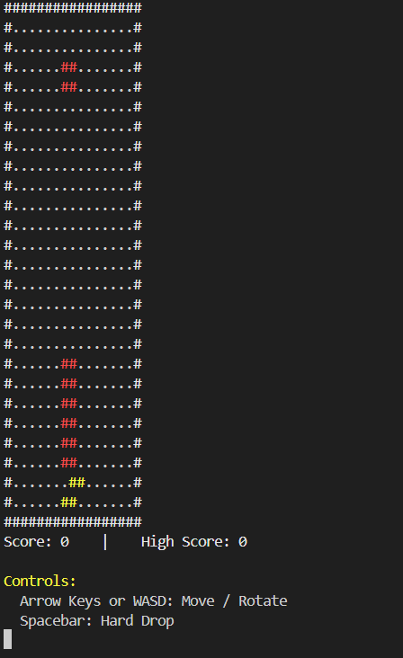

# 🎮 Console-Based Tetris Game (C++)

A console-based implementation of the classic **Tetris** game developed as part of a **course project** using **C++** and the **Windows Console API**. The project was built collaboratively in a team and features real-time Tetromino movement, rotation, line clearing, score tracking, session-based high score tracking, and color-coded rendering within the Windows console.

---

## ✨ Features

- 🎮 Classic Tetris gameplay with all **7 Tetromino** shapes
- ⌨️ Real-time movement and rotation using **Arrow Keys** or **WASD**
- ⚡ Hard Drop functionality using the **Spacebar**
- 🧹 Automatic line clearing with score updates
- 🏆 Session-based high score tracking
- 🎨 Color-coded Tetromino rendering using the Windows Console API
- 🔄 Restart or exit option after game over

---

## 🛠️ Technologies Used

- C++
- Windows Console API (`windows.h`)
- Standard Template Library (STL)
- `conio.h`

---

## 🎮 Controls

| Key | Action |
|------|--------|
| ← / A | Move Left |
| → / D | Move Right |
| ↓ / S | Move Down |
| ↑ / W | Rotate Tetromino |
| Space | Hard Drop |
| R | Restart Game |
| X | Exit Game |

---

## 📸 Screenshot

<p align="center">
  
</p>

---

## 📂 Project Structure

```text
Tetris-DS-Lab/
│
├── README.md
├── gameplay.png
└── tetris.cpp
```

---

## ⚙️ Requirements

- Windows Operating System
- C++ Compiler (MinGW or MSVC)
- Windows Console (Command Prompt, PowerShell, or Windows Terminal)

---

## 🚀 How to Run

### 1. Clone the repository

```bash
git clone https://github.com/SejalPatel01/Tetris-DS-Lab.git
```

### 2. Move into the project directory

```bash
cd Tetris-DS-Lab
```

### 3. Compile the program

```bash
g++ tetris.cpp -o tetris.exe
```

### 4. Run the executable

```bash
tetris.exe
```

---

## 🔮 Future Enhancements

- ⏸️ Pause and Resume functionality
- 🎵 Background music and sound effects
- 📈 Multiple difficulty levels
- 👀 Next Tetromino preview
- 💾 Persistent high score using file storage
- 🔄 Hold Tetromino feature

---

## 👥 Team

This project was developed collaboratively as part of a course project.

| Name | Student ID |
|------|------------|
| Sejal Patel | 202401155 |
| Prayag Kachhia | 202401168 |
| Rashi Patel | 202401154 |
